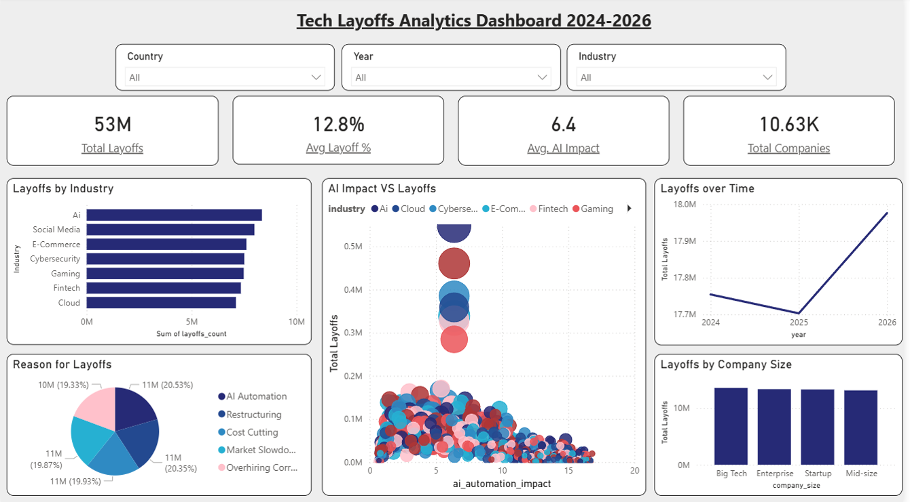

# Tech Layoffs Analytics Dashboard

## Overview

This project demonstrates an end-to-end data analysis and business intelligence workflow using a **sample technology layoffs dataset**.

The project starts with intentionally imperfect sample data, performs data-quality inspection and cleaning in Python, creates additional analytical fields, explores patterns using statistical analysis and visualisation, applies a Prophet forecasting model, and presents the results through an interactive Power BI dashboard.

> **Data Disclaimer:** The dataset used in this project is sample data created for educational and demonstration purposes. The figures shown in the analysis and Power BI dashboard are **not verified real-world technology layoff statistics** and should not be interpreted as official industry figures. The purpose of the project is to demonstrate data preparation, analysis, forecasting and dashboard development skills.

---

## Project Objectives

The main objectives of the project were to:

- Inspect and assess the quality of a raw sample dataset.
- Identify duplicates, missing values, invalid values and inconsistent text formatting.
- Clean and prepare the dataset for analysis.
- Create additional fields to support time-based and severity analysis.
- Explore layoffs across industries, countries and years.
- Examine relationships between AI automation impact and layoffs.
- Analyse the reported reasons for layoffs.
- Investigate correlations between numerical variables.
- Develop a 12-month layoff forecast using Prophet.
- Build an interactive Power BI dashboard to communicate analytical results.

---

## Dataset

The project uses a **sample technology layoffs dataset** containing company, workforce, financial, hiring, AI and market-related variables.

### Original sample dataset

- **12,300 rows**
- **23 columns**

### Cleaned dataset

- **10,627 rows**
- **26 columns**

The cleaning process also creates three additional analytical fields:

- `month_num`
- `date`
- `layoff_severity`

The dataset includes variables such as:

- Company name
- Industry
- Country
- Company size
- Month and year
- Layoffs count
- Layoff percentage
- Reason for layoffs
- AI automation impact
- AI replacement risk
- Open roles
- Hiring trend
- Remote jobs percentage
- Top hiring role
- Stock growth
- Revenue growth
- Salary budget change
- AI adoption level
- Employee sentiment
- Job security score
- Market condition

---

## Data Quality & Cleaning

The initial dataset was inspected for common data-quality issues before analysis.

The Python workflow checks for:

- Missing values
- Duplicate records
- Negative layoff counts
- Invalid layoff percentages
- Inconsistent text values
- Data types and statistical summaries

### Cleaning steps

The dataset was then processed using Pandas:

1. Removed duplicate rows.
2. Removed records with layoff percentages greater than 100.
3. Removed records with negative layoff counts.
4. Filled missing numerical values using median or mean values where appropriate.
5. Standardised text formatting for company, industry, country and hiring-trend fields.
6. Converted month names into numerical month values.
7. Created a standard date field.
8. Created a `layoff_severity` classification based on layoff percentage.
9. Exported the cleaned dataset as `tech_layoffs_cleaned.csv`.

This creates a reproducible workflow from raw sample data to an analysis-ready dataset.

---

## Exploratory Data Analysis

The analysis notebook explores several aspects of the dataset.

### Layoffs by Industry

Aggregates total layoffs across industries to identify differences between industry groups.

### Layoffs by Country

Identifies the top countries by total recorded layoffs within the sample dataset.

### Layoffs by Year

Examines changes in total recorded layoffs across the available years.

### AI Automation Impact vs Layoffs

Uses a scatter plot to explore the relationship between AI automation impact and recorded layoffs, with hiring trend used to distinguish observations.

### Correlation Analysis

A correlation heatmap is used to examine relationships between numerical variables in the cleaned dataset.

### Reasons for Layoffs

Analyses the distribution of the recorded reasons for layoffs using the sample data.

---

## Forecasting

The project also includes a time-series forecasting component using **Prophet**.

The forecasting workflow:

1. Aggregates recorded layoffs by year and month.
2. Creates a monthly date field.
3. Prepares the data in Prophet's required `ds` and `y` format.
4. Trains a Prophet model with yearly seasonality.
5. Generates a forecast for the following 12 months.
6. Produces a visual forecast output.

The forecast is based on the **sample dataset** and is intended as a demonstration of forecasting methodology rather than a prediction of actual future technology layoffs.

---

## Power BI Dashboard

The cleaned data was used to develop an interactive Power BI dashboard.

### Dashboard KPIs

The dashboard provides high-level measures including:

- Total Layoffs
- Average Layoff Percentage
- Average AI Impact
- Total Companies

### Interactive Filters

Users can filter the dashboard by:

- Country
- Year
- Industry

### Dashboard Visualisations

The dashboard includes:

- Layoffs by Industry
- AI Impact vs Layoffs
- Layoffs over Time
- Reasons for Layoffs
- Layoffs by Company Size

The dashboard is designed to provide a concise visual overview while allowing users to explore different segments of the sample dataset.

---

## Dashboard Preview



---

## Technologies Used

- **Python**
- **Pandas**
- **NumPy**
- **Matplotlib**
- **Seaborn**
- **Prophet**
- **Jupyter Notebook**
- **Power BI**
- **CSV**

---

## Project Structure

```text
Tech-Layoffs-Analytics/
│
├── README.md
│
├── data/
│   ├── tech_layoffs_dirtydata.csv
│   └── tech_layoffs_cleaned.csv
│
├── analysis/
│   └── analysis.ipynb
│
├── code/
│   └── [Python source files]
│
├── powerbi/
│   └── tech_layoffs_powerbi.pbix
│
└── screenshots/
    └── Dashboard.png
```

The analysis notebook contains the exploratory analysis, visualisation and Prophet forecasting workflow. The generated analysis images do not need to be stored separately because they can be reproduced by running the notebook.

---

## How to Run

### Python Analysis

1. Install Python.
2. Install the required libraries:

```bash
pip install pandas numpy matplotlib seaborn prophet jupyter
```

3. Place the files from the `data` folder in the working directory expected by the notebook.
4. Open:

```text
analysis/analysis.ipynb
```

5. Run the notebook cells in order.

The notebook will:

- Load the sample dirty dataset.
- Inspect data quality.
- Clean and transform the data.
- Save `tech_layoffs_cleaned.csv`.
- Generate exploratory analysis visualisations.
- Run the Prophet forecasting model.
- Generate the forecast visualisation.

### Power BI

1. Install Power BI Desktop.
2. Open:

```text
powerbi/tech_layoffs_powerbi.pbix
```

3. If Power BI requests a data-source location, update the source to the location of `tech_layoffs_cleaned.csv`.
4. Refresh the data if required.

---

## Skills Demonstrated

This project demonstrates practical experience with:

- Data cleaning and preparation
- Data-quality assessment
- Exploratory data analysis
- Python/Pandas
- Statistical analysis
- Data visualisation
- Time-series analysis
- Forecasting with Prophet
- Power BI dashboard development
- KPI reporting
- Interactive data filtering
- Analytical communication

---

## Project Workflow

```text
Sample Dirty Data
       │
       ▼
Data Quality Inspection
       │
       ▼
Python / Pandas Cleaning
       │
       ▼
Cleaned Dataset
       │
       ├──────────────► Exploratory Analysis
       │
       ├──────────────► Correlation Analysis
       │
       ├──────────────► Prophet Forecasting
       │
       ▼
Power BI Dashboard
       │
       ▼
Interactive Visual Analysis
```

---

## Author

**Pujan Kalu**

Master of Business Informatics – Business Analytics  
BSc (Hons) Computer Systems Engineering

GitHub: [PujanKalu](https://github.com/PujanKalu)
